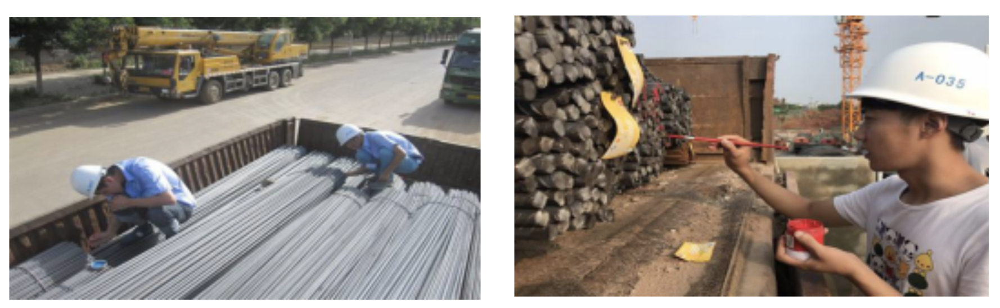
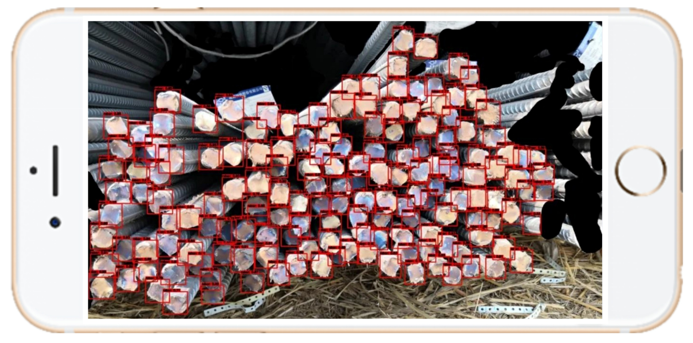
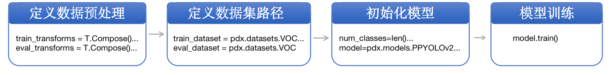
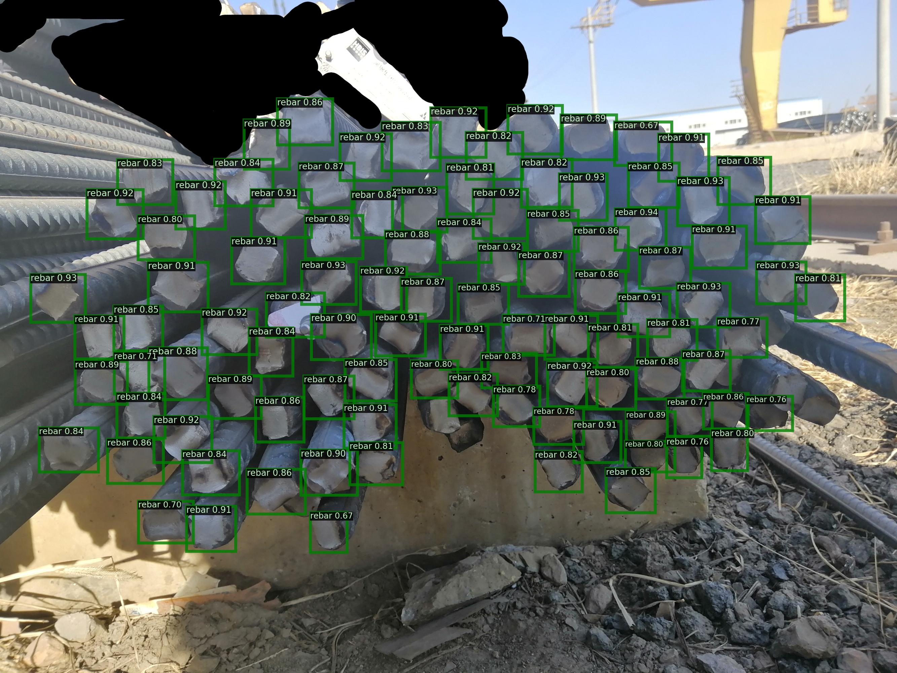
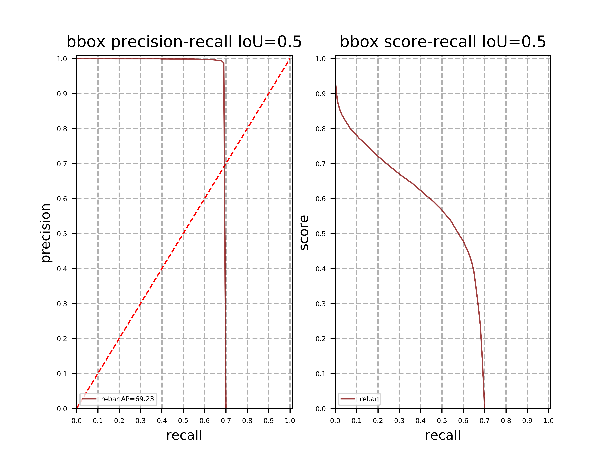
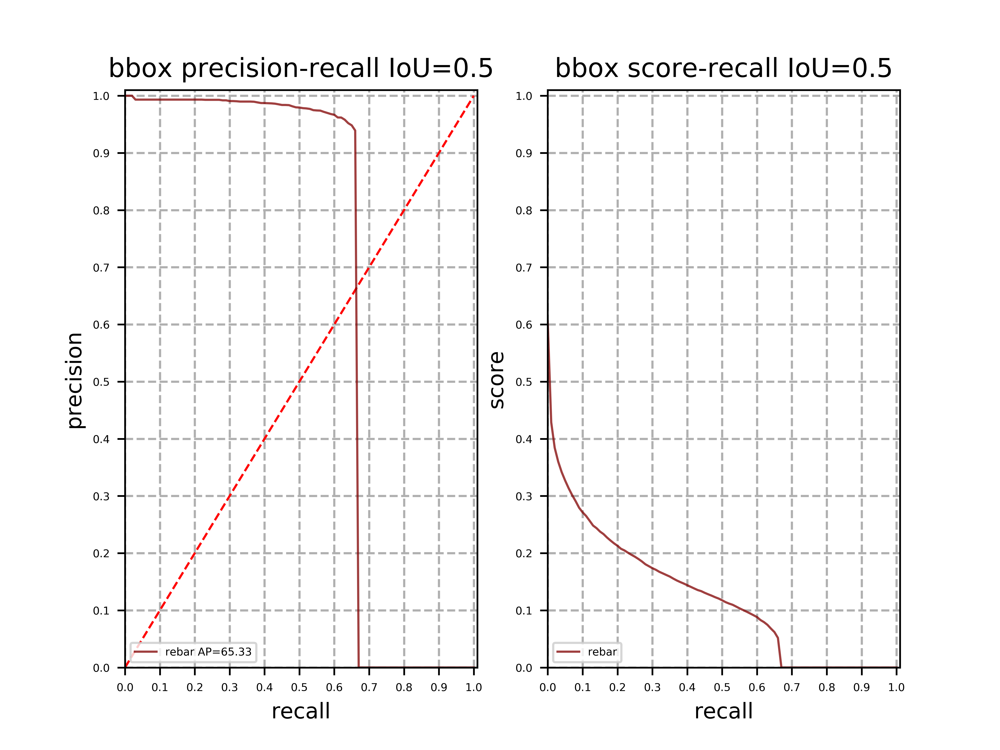
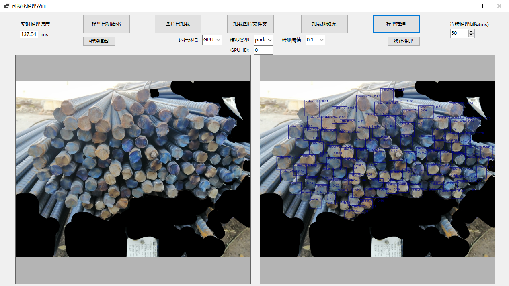

# 钢筋计数

## 1.项目概述

在该项目中，主要向大家介绍如何使用<!--PaddleX目标检测，产品+功能要重点强调-->来实现对钢筋计数。涉及<!--方案和代码-->亦可用于**车辆计数**、**螺母计数**、**圆木计数**等<!--相似的场景，需要描述一下，例如：高密集？-->。

在工地现场，对于进场的钢筋车，验收人员需要对车上的钢筋进行现场人工点根，确认数量后钢筋车才能完成进场卸货。过程繁琐、消耗大量人力且速度很慢。针对上述问题，本项目希望通过手机拍照完成目标检测计数，以人工修改少量误检的方式为辅助，智能、高效地完成钢筋计数任务。<!--本项目使用PaddleX的XX功能，通过手机……这里要突出我们的技术方案，而不是手机拍照-->

<div align="center">
    
</div>

**业务难点：** <!--方案难点是不是更合适-->

- **精度要求高** 钢筋本身价格较贵，且数量庞大且密集，如果存在误检和漏检，都需要人工在大量的标记点中找出，所以需要精度非常高才能保证验收人员的使用体验。<!--因此，对于模型精度要求非常高-->。需要专门针对此密集目标的检测算法进行优化，另外，还需要处理拍摄角度、光线不完全受控，钢筋存在长短不齐、可能存在遮挡等情况。<!--不受控的话术需要-->
- **钢筋尺寸不一** 钢筋的直径变化范围较大且截面形状不规则、颜色不一，拍摄的角度、距离也不完全受控，这也导致传统算法在实际使用的过程中效果很难稳定。<!--和痛点1重复？-->
- **边界难以区分** 一辆钢筋车一次会运输很多捆钢筋，如果直接全部处理会存在边缘角度差、遮挡等问题效果不好，目前在用单捆处理+最后合计的流程，这样的处理过程就会需要对捆间进行分割或者对最终结果进行去重，难度较大。

<div align="center">
    
</div>


## 2.数据准备

* **数据下载** <!--数据获取--> 本项目使用的数据集<!--数据集名称，来源，这里看看是否要把贡献案例的企业也介绍一下，更具有真实性-->中包含了250张已经标注好的图像数据，原始数据标注形式为csv格式。该项目采用目标检测的标注方式，在本文档中提供了VOC数据集格式。[点击此处下载数据集](https://bj.bcebos.com/paddlex/examples2/rebar_count/dataset_reinforcing_steel_bar_counting.zip)。<!--如何将csv格式数据转换成VOC格式，建议将标注指导提前到这里-->

- **数据切分** <!--数据集拆分--> 数据集拆分将训练集、验证集按照8.5:1.5的比例切分<!--将数据按8.5：1.5的比例，拆分成训练集和验证集-->。 PaddleX中提供了简单易用的API，方便用户直接使用进行数据划分。<!--使用PaddleX API，一行代码即可实现-->。

```
paddlex --split_dataset --format VOC --dataset_dir dataset --val_value 0.15
```

数据文件夹切分前后的状态如下:

```
  dataset/                          dataset/
  ├── Annotations/      -->         ├── Annotations/
  ├── JPEGImages/                   ├── JPEGImages/
                                    ├── labels.txt
                                    ├── train_list.txt
                                    ├── val_list.txt
```

* **数据标注指导** 更多数据格式信息请参考[数据标注说明文档](https://paddlex.readthedocs.io/zh_CN/develop/data/annotation/index.html)。

## 3.模型选择<!--补充为什么选择YOLO系列模型，即说明模型选择的依据-->

PaddleX提供了丰富的视觉模型。在目标检测任务中，PaddleX提供了RCNN和YOLO系列模型。在本项目中采用YOLO系列作为检测模型进行钢筋计数。

## 4. 模型训练 

- 本项目中采用YOLOv3作为钢筋检测的模型，模型训练需要经过如下环节：

<div align="center">
    
</div>

具体代码请参考[train.py](./code/train.py)。<!--这里需要补充py文件哪些参数需要修改，结合流程图-->

运行如下代码开始训练模型：

```
python code/train.py
```

若输入如下代码，则可在log文件中查看训练日志，log文件保存在`code`目标下

```
python code/train.py > log
```


### 模型评估<!--添加模型评估结果展示，baseline效果-->

模型评估结果展示。

## 5.模型优化

<!--模型优化策略：-->为了进一步提升模型的精度，在项目中采用了一系列模型优化的方式，<!--举例说明优化策略有哪些，-->

<!--推理时间计算方式：-->采用PaddleX在Tesla V100上测试模型的推理时间（输入数据拷贝至GPU的时间、计算时间、数据拷贝至CPU的时间），推理时间如下表所示：（**20次推理取平均耗时**）

> 由于参与推理的图片较大，因此预处理时间在**Resize处**会消耗较多的时间。

| 模型                                                         | 推理时间 （ms/image） | map(Iou-0.5) | (coco)mmap |
| ------------------------------------------------------------ | :-------------------: | ------------ | ---------- |
| **baseline: YOLOv3 - MobileNetV1+label_smooth=False +img_size(480)** |      **152.40**       | 65.3         | 38.3       |
| YOLOv3 + MobileNetV1 + label_smooth=True + cluster_yolo_anchor+img_size(480) |        156.86         | 57.4         | 29.0       |
| YOLOv3 + ResNet34 + label_smooth=False  +cluster_yolo_anchor+ img_size(480) |        154.49         | 66.5         | 37.7       |
| PPYOLO + ResNet50_vd_ssld+ label_smooth=False+ cluster_yolo_anchor + img_size(608) |        221.31         | 66.5         | 43.7       |
| YOLOv3 + DarkNet53 + label_smooth=False+ img_size(608)       |        173.05         | 67.9         | 47.1       |
| **YOLOv3 + ResNet34 + label_smooth=False + img_size(608)**   |        161.45         | **69.2**     | **48.1**   |

注意: 

- 对于尺寸大小为608的图像，一般使用默认的anchors进行训练和推理即可。
- **cluster_yolo_anchor**: 来源**paddlex2.0API**，用于生成拟合数据集的模型anchor

```
anchors = train_dataset.cluster_yolo_anchor(num_anchors=9, image_size=480)
anchor_masks = [[6, 7, 8], [3, 4, 5], [0, 1, 2]]
```

**优化进展说明**：<!--标题修改为：模型优化思路-->

- 1.通过选择**更好的backbone**作为特征提取的骨干网络可以提高识别率、降低漏检率。<**MobileNetV1 到 ResNet50_vd_ssld**>
- 2.通过选择理论上更好的检测架构**PPYOLO**未获得明显的完全性能提升(`Iou0.5提升不是很大`)，但也提高了检测的mmap值——即**Neck，Head部分的优化**可以提高ap。<**YOLOV3 到 PPYOLO**>
- 3.缩放适当的图像大小可以**提高模型的识别率**，但是存在一定的阈值——当图像大小到某一个阈值时会导致精度下降。

  - **一般图像大小选择(YOLO系列)**:320，480， 608。
  - 一般**图像如果较大，物体也比较大**，可以较为放心的缩小图像大小再进行相关的训练和预测。
  - 物体较小，不易缩小，**可以适当的裁剪划分原图或放大**，并处理对应的标注数据，再进行训练。<**480到608**>

- 4.一般情况通过cluster_yolo_anchor生成当前网络输入图像大小下拟合数据集的预置anchors，利用新生成的anchors替换原来的默认anchor，会使得模型预测定位上框选**位置更准确**，但是本次实验并未得到提升。
- 5.最初的两个YOLOV3的实验可以发现，本次优化中，如果**开启label_smooth，会导致预测ap下降**——原因是**标签平滑相当于一种正则化**，当前模型存在的问题是拟合不够好，因此加入标签平滑会适得其反。（批注：ap是什么？map？）

通过以上的简单优化方式，获取了两个较好的模型结果:【前者模型**体积更小**】

| 模型                                                         | 推理时间 （ms/image） | map(Iou-0.5) | (coco)mmap |
| ------------------------------------------------------------ | --------------------- | ------------ | ---------- |
| **baseline: YOLOv3 - MobileNetV1+label_smooth=False +img_size(480)** | **152.40**            | 65.3         | 38.3       |
| **YOLOv3 + ResNet34 + label_smooth=False + img_size(608)**   | 161.45                | **69.2**     | **48.1**   |

## 具体请参考[模型优化文档](./accuracy_improvement.md)。


## 7.模型推理

运行如下代码：

```
python code/infer.py
```

则可生成result.txt文件并显示推理结果图片，result.txt文件中会显示图片中每个检测框的位置、类别及置信度，并给出检测框的总个数，从而实现了钢筋自动计数。

推理结果如下：

<div align="center">
    
</div>
## 8.模型部署

### **8.1 模型导出** 

模型训练后保存在output文件夹，如果要使用PaddleInference进行部署需要导出成静态图的模型。运行如下命令，会自动在output文件夹下创建一个`inference_model`的文件夹，用来存放导出后的模型。

```
paddlex --export_inference --model_dir=output/yolov3_resnet34/best_model --save_dir=output/inference_model --fixed_input_shape=[608,608]
```

> **注意**：设定 fixed_input_shape 的数值需与 eval_transforms 中设置的 target_size 数值上保持一致。

### **8.2 模型上线选择**

#### (1)针对GPU端部署 <!--GPU部署结果+部署指导-->

本案例选择**面向GPU端**的最终方案是选择一阶段检测模型**YOLOv3**，其骨干网络选择加入了**ResNet34**，训练阶段数据增强策略采用RandomHorizontalFlip、RandomDistort、RandomCrop等。

在Tesla V100的Linux系统下，模型的推理时间大约为**161.45ms/image**，包括**transform、输入数据拷贝至GPU的时间、计算时间、数据拷贝至CPU**的时间。

| 模型                                                       | 推理时间 (ms/image) | map(Iou-0.5) | (coco)mmap |
| ---------------------------------------------------------- | ------------------- | ------------ | ---------- |
| **YOLOv3 + ResNet34 + label_smooth=False + img_size(608)** | 161.45              | **69.2**     | **48.1**   |

**上线模型的PR曲线:**

<div align="center">
    
</div>


在本项目中的钢筋检测数据中，标注信息错误较少，但是**拍摄角度以及光照变化范围较大**，从而影响模型的学习。针对本项目的问题而言，钢筋检测中的**召回率比较低，而准确率较高**。

> **注意**: 通过COCO指标使得评估时对多Iou尺度进行一个较完整的评估，使得得到该评估指标下最好的模型，以期望获得最好的泛化能力。

#### (2)针对移动端部署 <!--移动端部署结果+部署指导-->

本案例选择**面向移动端**的最终方案是选择一阶段检测模型**YOLOV3**，其骨干网络选择加入了**MobileNetV1**，训练阶段数据增强策略采用RandomHorizontalFlip、RandomDistort、RandomCrop等。

在Tesla V100的Linux系统下，模型的推理时间大约为**152.40ms/image**，包括**transform、输入数据拷贝至GPU的时间、计算时间、数据拷贝至CPU**的时间。

| 模型                                                         | 推理时间 (ms/image) | map(Iou-0.5) | (coco)mmap |
| ------------------------------------------------------------ | ------------------- | ------------ | ---------- |
| **baseline: YOLOv3 - MobileNetV1+label_smooth=False +img_size(480)** | **152.40**          | 65.3         | 38.3       |

**上线模型的PR曲线:**

<div align="center">
    
</div>

相对于GPU端上线模型，该模型具有以下优势:

- 模型参数大小仅为: **145MB**，而GPU端模型为:**253MB**。
- 输入图像更小，模型计算**时间花销更小**。
- **召回率更低**，可能有更少的误检——但由于模型轻量化缘故，漏检情况可能会更多一点。

### 8.3 模型部署方式

模型部署采用了PaddleX提供的C++ inference部署方案，在改方案中提供了C#部署[Demo](https://github.com/PaddlePaddle/PaddleX/tree/release/2.0.0/examples/C%23_deploy)，用户可根据实际情况自行参考。

<div align="center">
    
</div>